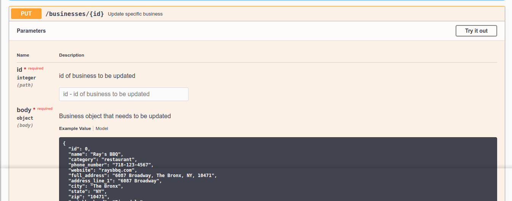
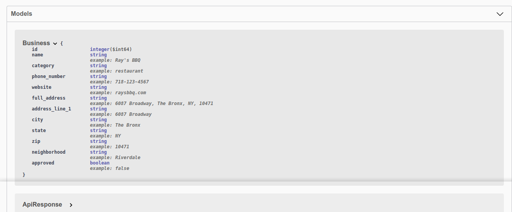

# How to deploy the shop-equal-api-documentation

The shop equal api provides ....





## Docker Quick Start

Clone the shop-equal-api-documentation repo
```
git clone https://github.com/shopequal/shop-equal-api-documentation.git

```
cd into the directory
```
cd shop-equal-api-documentation
```

To run Docker 
```
docker run -p 80:8080 -e SWAGGER_JSON=/data/swagger.json -v $(pwd)/data:/data swaggerapi/swagger-ui
```

To run docker in the background
```
docker run -d -p 80:8080 -e SWAGGER_JSON=/data/swagger.json -v $(pwd)/data:/data swaggerapi/swagger-ui
```

To access the swagger api open your web broswer and type in localhost

> As you update the swagger.json the api should update as well in teh web browser after you refresh.

## Using RHEL image 
Work in Progress