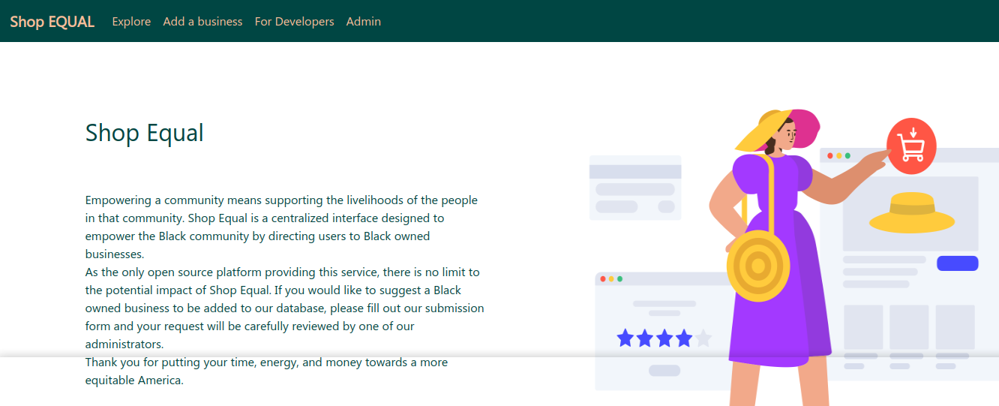
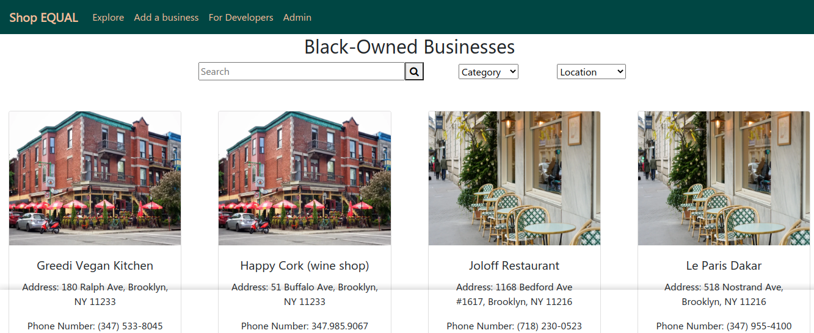

# How to deploy the shop-equal-api-frontend

The shop equal frontend consists of ...





## Docker Quick Start for developers

git clone start-here repo
```
git clone https://github.com/tosin2013/start-here.git
```

Cd into shop-equal-frontend folder
```
cd  shop-equal-frontend
```

Clone shop-equal-frontend repo
```
git clone https://github.com/shopequal/shop-equal-frontend.git
```

cp Dockerfile to shop-equal-frontend
```
cp docker/Dockerfile shop-equal-frontend/
```

cd into frontend directory
```
cd  shop-equal-frontend
```

Build Docker File
```
docker build -t shop-equal-frontend .
```

When docker build completes check that the image exists
```
$ docker images 
REPOSITORY                                   TAG                 IMAGE ID            CREATED              SIZE
shop-equal-frontend                          latest              ca88bece6fde        About a minute ago   488MB
```

Lets start the image 
```
 docker run \
    -it \
    --rm \
    -v ${PWD}:/app \
    -v /app/node_modules \
    -p 3001:3000 \
    -e CHOKIDAR_USEPOLLING=true \
    shop-equal-frontend:latest
```

To access the swagger api open your web broswer and type in localhost:3031

> As you update your source code the front end should reflect changes.

#### To exit docker container run CTRL+C